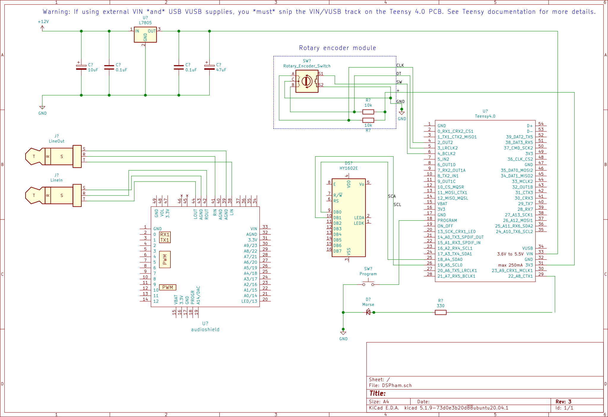

# DSPham

  A DSP audio processor aimed at radio amateurs

This project is a DSP audio processor, aimed at the radio amateurs. It's key features include:

- Multiple noise reduction algorithms
- Multiple morce (CW) decoders
- Auto-notch (tone) removal
- Noise blanker (impulse) removal
- Configurable bandpass filtering

It has audio input via line-in and USB, and audio output via line-out and headphone socket.

I built it as I had an SDR based transceiver with no built in noise reduction, and wanted to see
what was possible to improve that situation. In the spirit of amateur radio, and because my background
is in embedded programming, I didn't want to purchase a ready made unit, so I went about building and
coding up my own.

As an added bonus, the CW decoders tend to be better than the one built into my transceiver, and auto
detect key speed.

## Honorable mentions

Here I should say, this project is 'built on the shoulders of giants'. All the technically challenging
hard math innards of the code has been derived and extracted from other projects. My task was merely
researching, collating and knitting together all the relevant parts into one functional unit with the
features I was looking for. Without the work of the below mentioned, and many others, this project
would have been orders of magnitudes more difficult, and have taken significantly longer to put
together.

Honorable mentions then to:

  - The authors and contributors to the [Teensy-ConvolutionSDR][1] project, along with the closely
    related [UHSDR][2] and [wdsp][3] projects, from which much of the noise reduction and other
    code has been derived.
  - GI1MIC and the [$19 DSP Filter][4] project, for inspiration, showing the use of a Teensy, and
    for Morse decoder and filter code.
  - [PJRC][5], [Paul Stoffregen][6], and the Teensy community for creating a fantastically usable
    powerful Arduino-like board, along with documentation, examples and excellent supporting libraries.
    Highly recommended.
  - [K4ICY][7] and [TF3LJ][8] for alternative Morse Decoders.

and many others.

## Hardware

The basic hardware is built around a [Teensy 4.0][9] board along with its matching
[audio daugthercard][10]. In addition to that there is a 2x16 screen, a single LED, a rotary click
encoder and a switch to enter reprogramming mode. That's it. Pretty simple.

The heavy lifting is done by the Teensy and its audio card. I used an I2C based [Grove RGB LCD][13]
merely as that is what I had to hand. If I'd had a standard HD44780 style 2x16 display to hand then
I probably would have driven that in 4bit mode instead.

> *Note:* In the circuit diagram, the LCD type shown is incorrect - only because the package I used
  did not have the Grove RGB LCD I2C in its library. You get the idea - there are only two data wires
  going to the LCD (along with the two power connections).

## Software architecture

The software is built using the Aruduino IDE along with the [Teensyduino][12] addon.

The software is architected around the flow of the excellent [PJRC Teensy audio library][14], and
its associated GUI design tool.

A key feature, and a powerful feature of the audio library, is that inbetween the two data queues we
can, and do, apply other processing to the data flow, such as using the [ARM CMSIS][11] functions or
open coding algorithms (as is done for some of the noise reduction code).

Presently the whole flow runs at the native audio library 44.1kHz. This costs us processing and data
bandwidth overhead, but gives us a little simplicity, skipping any decimation and interpolation steps.
Later it may be necessary or desirable to move to a decimated datapath, for reasons including:

- will take less processing time and data flow overheads
- will give us better filtering (FIR filters for instance) for the same number of 'taps'
- may improve the noise reduction, by allowing finer grained 'bins'

### Display

### Menu system

### Settings

## Feature list

The followin features are in the current code:

  - A selection of noise reduction algorithms, including:
    - Least Means Square
    - Exponential smoothing moving filter
    - Average smoothing moving filter
    - Spectral noise reduction, with a choice of algorithms
  - Noise blanker
  - Auto-notch filter (tone/whistle removal)
  - Configurable band pass filtering, with user memories and presets for:
    - SSB
    - CW
    - FM
    - AM
  - A selection of CW decoders
    - GI1MIC/WB7FHC 'morseduino' decoder
    - K4ICY using geometric mean for pulse categorisation
    - TF3LJ Bayesian based decoder
  - Hardware AGC or software volume tracking (note, this is *not* a full AGC, yet).
  - Ability to bypass all features (to aid comparison)
  - 2x16 LCD display for status, settings and morse decode
  - LED indicator for morse detection confirmation.
  - line and USB audio in
  - line and headphone out
  - 11 user configurable setting memories, 6 pre-loaded with defaults
  - menu driven configuration via rotary click encoder

## Building and Development

The project is built using the Arduino IDE with the [Teensyduino addon][12]. In order to build the
project you will need a few extra libraries and to configure your Teensy 4.0 board correctly:

- Set your Teensy 4.0 board up in the Arduino IDE as:
  - Teensy 4.0
  - Serial+MIDI+Audio setup
  - 600MHz
- Add the [Grove RGB LCD library][15] to your Arduino installation
- Add the [Arduino Menu library][16] to your Arduino installation
  - *Note:* You will need a version that includes [my addition for RGB LCD support][17], which
    means you may have to install this one from source. of you use the same LCD that is. I believe
    you need a version that is > v4.21.4 ?
- Add the [Click Encoder library][18]. You may need to install this one from source.

That should give you the correct setup and libraries to build and program the project. The most common
mistake I make is to not set up the correct 'USB Type' for the Teensy audio shield support, which tends
to end in errors such as `Audio.h not found` etc.

## Birdies!

If you do build yourself one of these, then watch out for RF emissions! I initially had a lot of noise
being injected into my system, and had to shield the case, add isolation and ferrites, but *most
importantly* was to add a good set of smoothing and filtering capacitors to the 7805 PSU. Do not skimp
on that, as I learnt.

If you do build one of these, and have any questions etc., feel free to ask. Probably the best place
to ask is via a GitHub Issue, as then we get a recorded history to help others in the future.

[1]: https://github.com/DD4WH/Teensy-ConvolutionSDR "Teensy-ConvolutionSDR"
[2]: https://github.com/df8oe/UHSDR "UHSDR"
[3]: https://github.com/NR0V/wdsp "wdsp library"
[4]: https://gi1mic.github.io/ "$19 DSP Filter"
[5]: https://www.pjrc.com/ "PJRC"
[6]: https://github.com/PaulStoffregen/Audio "Paul Stoffregen"
[7]: http://k4icy.com/cw_decoder.html "K4ICY Morce Decoder"
[8]: https://sites.google.com/site/lofturj/cwreceive "TF3LJ bayesian CW"
[9]: https://www.pjrc.com/store/teensy40.html "Teensy 4.0"
[10]: https://www.pjrc.com/store/teensy3_audio.html "Teensy audio adaptor"
[11]: https://developer.arm.com/tools-and-software/embedded/cmsis "ARM CMSIS"
[12]: https://www.pjrc.com/teensy/teensyduino.html "Teensyduino"
[13]: https://wiki.seeedstudio.com/Grove-LCD_RGB_Backlight/ "Grove RGB LCD"
[14]: https://www.pjrc.com/teensy/td_libs_Audio.html "Teensy audio library"
[15]: https://github.com/Seeed-Studio/Grove_LCD_RGB_Backlight "RGB LCD library"
[16]: https://github.com/neu-rah/ArduinoMenu "Arduino Menu"
[17]: https://github.com/neu-rah/ArduinoMenu/pull/331 "RGB LCD menu support PR"
[18]: https://github.com/soligen2010/encoder "ClickEncoder"
